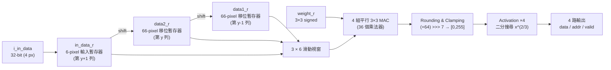
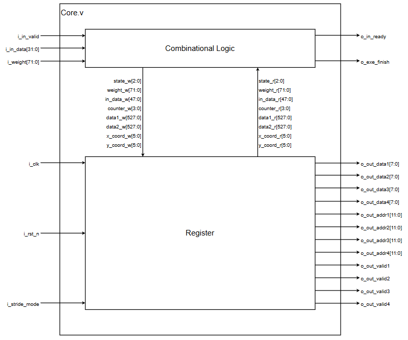
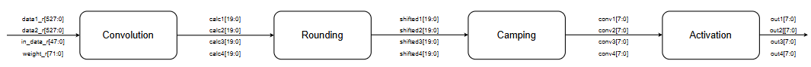
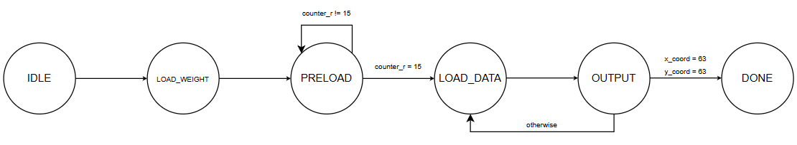
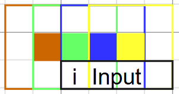
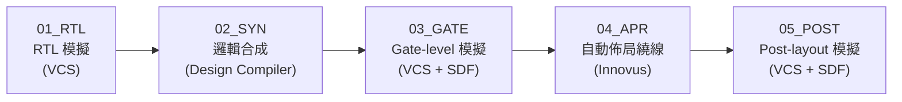
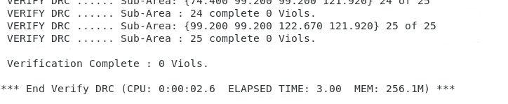
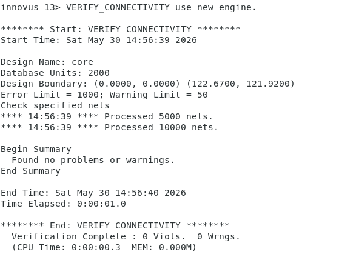
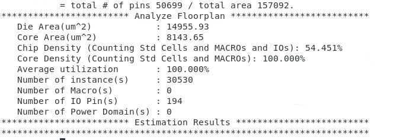
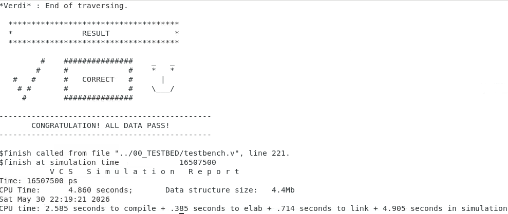

# 積體電路設計 (Integrated Circuit Design, ICD)

國立臺灣大學 電機工程學系 · 114 學年度第 2 學期

本資料夾收錄「積體電路設計」課程的作業與期末專題。HW2–HW5 是 EDA 工具練習（SPICE → RTL → Synthesis → APR）。**期末專題 [1142_ICD_final/](1142_ICD_final/)** 則把這些工具串成一條完整的數位 IC 設計流程：從 RTL 撰寫一路做到 post-layout simulation，實作一顆 **影像卷積加速器 (Image Convolution Engine)**。

---

## 目錄

- [Final Project：影像卷積加速器](#final-project影像卷積加速器)
  - [成果摘要](#成果摘要)
  - [題目規格](#題目規格)
  - [硬體架構](#硬體架構)
  - [設計重點](#設計重點)
  - [設計流程](#設計流程)
  - [驗證結果](#驗證結果)
  - [檔案結構](#檔案結構)
  - [執行方式](#執行方式)
- [作業 (HW2–HW5)](#作業-hw2hw5)
- [開發環境](#開發環境)

---

## Final Project：影像卷積加速器

> 兩人分組專題：吳偉弘（B12901002）、謝承恩（B12901185）
> 完整書面報告：[b12901185_report-5.pdf](1142_ICD_final/b12901185_report-5.pdf)

### 成果摘要

| 指標 | 結果 |
| --- | --- |
| Clock period | **7.5 ns（133 MHz）**，post-layout 仍時序正確 |
| 處理時間 | 一張 64×64 影像約 **2,200 cycles（≈ 16.5 µs）**，stride 1 / stride 2 相同 |
| Die area | **14,955.93 µm²**（122.67 µm × 121.92 µm） |
| Core area | 8,143.65 µm² |
| Instance 數 | 30,530（無 memory macro） |
| DRC / Connectivity | **0 violations / 0 violations** |
| 功能驗證 | 4 組測資（stride 1 ×2、stride 2 ×2）在 RTL、gate-level、post-layout 三個階段全部通過 |

### 題目規格

| 項目 | 規格 |
| --- | --- |
| 輸入影像 | 64 × 64，8-bit unsigned 灰階像素 |
| 輸入頻寬 | 32-bit / cycle（每拍 4 個像素），以 `i_in_valid` / `o_in_ready` handshake 傳輸 |
| 卷積核 | 3 × 3，8-bit signed 權重（72-bit，只在一個 cycle 有效） |
| 邊界處理 | Zero padding（same convolution） |
| Stride | `i_stride_mode = 0` → stride 1，輸出 64 × 64；`= 1` → stride 2，輸出 32 × 32 |
| 後處理 | `(sum + 64) >>> 7` 四捨五入 → clamp 到 [0, 255] → activation f(x) = x^(2/3)（取整數） |
| 輸出介面 | 4 組 `(valid, addr[11:0], data[7:0])`，每組各自帶位址，可平行寫回 |
| 製程 | TSMC 16nm ADFP 標準元件庫（ss0p72v125c corner） |

### 硬體架構



<details>
<summary>報告中的 block diagram 與運算管線</summary>

<p align="center"></p>
<p align="center"></p>

</details>

**控制 FSM**

<p align="center"></p>

| 狀態 | 功能 |
| --- | --- |
| `IDLE` | 重置內部暫存器 |
| `LOAD_WEIGHT` | 鎖存 3×3 權重 |
| `PRELOAD` | 先讀入第 0 列（16 筆 × 4 px）到 row buffer |
| `LOAD_DATA` | 讀入下一列的 4 個像素，整個視窗向左移位 |
| `OUTPUT` | 同時算出 4 個輸出像素，並依 stride 模式產生位址與 valid |
| `DONE` | 拉高 `o_exe_finish` |

`LOAD_DATA` 和 `OUTPUT` 兩個狀態交替執行，每 2 個 cycle 產生 4 個輸出像素。

### 設計重點

1. **只存兩列資料，邊讀邊算**
   我們不先把整張影像存起來，而是資料一進來就開始計算，下一個 cycle 輸出結果，以同時降低面積和處理時間。3×3 卷積需要相鄰三列的資料，我們用兩條 528-bit（66 像素 = 64 像素 + 左右各 1 個 zero padding）的移位暫存器 `data1_r`、`data2_r` 當作「延遲一列」的 line buffer，再搭配一個 6-pixel 的輸入暫存器 `in_data_r`。新像素每次從尾端移入，三列資料的最前端正好組成 3 × 6 的滑動視窗。整個設計不需要任何 SRAM macro，也不需要另外寫讀寫位址的控制邏輯。

2. **4-way 平行運算**
   每讀入 4 個新像素，一個 3 × 6 視窗就能同時算出 4 個相鄰的輸出像素（`out1`–`out4`）。所以我們放了 4 組 3×3 MAC（共 36 個 8-bit signed × 9-bit 乘法器）平行計算，吞吐量對應 32-bit 的輸入頻寬。

   <p align="center"></p>

3. **Zero padding 與邊界情況直接融入資料移位**
   - 每列開頭（`x = 0`）移 5 格、中間移 4 格、結尾（`x = 63`）只移 1 格，這樣剛好補出左右兩側的 0；`x = 0` 時 `out1` 沒有對應的有效像素，所以不輸出。
   - `x = 60` 時已經有 5 個像素可以計算，但一次只能輸出 4 個，所以把最後一個留到下一步（`x = 63`），由 `out4` 單獨輸出。
   - 第一列靠 `PRELOAD` 時清空的 `data1_r` 產生上方 padding；最後一列（`y = 63`）改為移入 0，產生下方 padding。
   - 在 padding 期間把 `o_in_ready` 拉低，讓外部暫停送資料，因此輸入端不需要額外的 buffer。

4. **Activation 函數 x^(2/3) 的硬體實作**
   Clamp 後的輸入只有 0–255，所以 x^(2/3) 的整數結果只會落在 0–40。我們把它寫成 **單一 cycle 內完成的 6 次迭代二分搜尋**：在 [0, 40] 中找最大的 m，使 m³ ≤ x²。這個電路只用到乘法和比較，避開了除法器或大型 LUT。

5. **Stride-2 共用同一條 datapath**
   Stride 2 不另外設計電路，只在偶數列、取 `out2`、`out4`（偶數行）時拉高 valid，並把位址換算成 32 × 32 的輸出座標 `(y/2)·32 + x/2`。

完整的 data flow 逐步圖解請見[書面報告](1142_ICD_final/b12901185_report-5.pdf)第 6–8 頁。

### 設計流程



| 階段 | 內容 |
| --- | --- |
| **RTL** | 用 4 組 testbench pattern（`tb1`/`tb2`：stride 1，`tb3`/`tb4`：stride 2）逐像素比對 golden |
| **Synthesis** | `compile_ultra`，時序限制包含 clock uncertainty 0.1 ns、I/O delay 0.5 ns，產出 netlist、SDF 與 area / timing report |
| **Gate-level Sim** | 標上合成後的 SDF，驗證含 cell delay 的功能正確性 |
| **APR** | 以 MMMC（worst RC corner、0.72 V / 125 °C）進行 floorplan、power ring / stripe、placement、CTS、routing、filler / endcap / well tap 插入，並檢查 DRC 與 connectivity |
| **Post-layout Sim** | 標上 APR 後萃取的 SDF，驗證最終佈局的時序與功能 |

### 驗證結果

<table>
<tr>
<td align="center"><b>DRC：0 Viols</b><br></td>
<td align="center"><b>Connectivity：0 Viols / 0 Wrngs</b><br></td>
</tr>
<tr>
<td align="center"><b>Floorplan / Area</b><br></td>
<td align="center"><b>Post-layout Simulation（tb1）</b><br></td>
</tr>
</table>

4 組測資的 post-layout simulation 在 7.5 ns 下全部通過，總模擬時間皆為 16,507,500 ps。其他測資的截圖請見書面報告。

### 檔案結構

```
1142_ICD_final/
├── b12901185_report-5.pdf       # 期末書面報告
├── docs/                        # README 使用的報告截圖
├── 00_TESTBED/
│   ├── testbench.v              # 送資料、收輸出並與 golden 比對
│   └── PATTERNS/                # 4 組測資：輸入影像 / 權重 / golden
├── 01_RTL/
│   ├── core.v                   # ★ 設計本體
│   ├── rtl.f
│   └── 01_run.sh
├── 02_SYN/
│   ├── syn.tcl                  # Design Compiler 合成腳本
│   ├── core.sdc                 # 時序限制
│   └── 02_run.sh
├── 03_GATE/
│   ├── gate.f / cycle.txt
│   └── 03_run.sh
├── 04_APR/
│   ├── mmmc.view                # Multi-mode multi-corner 設定
│   └── lab_script/              # Innovus 各步驟 Tcl 腳本
└── 05_POST/
    ├── post.f / cycle.txt
    └── 05_run.sh
```

> 合成與 APR 的產出（`Netlist/`、`Report/`、`core_APR.v`、`core_APR.sdf` 等）由工具產生，未放進版本控制。

### 執行方式

需要在具備 Synopsys / Cadence 工具與 ADFP 製程檔（`/share1/tech/ADFP`）的工作站上執行。Clock period 由 `02_SYN/core.sdc` 的 `cycle` 與 `03_GATE/`、`05_POST/` 下的 `cycle.txt` 設定。

```bash
# 1. RTL simulation（在 01_run.sh 中以 +define+tb1~tb4 切換測資）
cd 01_RTL && sh 01_run.sh

# 2. Synthesis
cd ../02_SYN && sh 02_run.sh

# 3. Gate-level simulation
cd ../03_GATE && sh 03_run.sh

# 4. APR：在 Innovus 中依序 source 04_APR/lab_script/ 下的腳本

# 5. Post-layout simulation
cd ../05_POST && sh 05_run.sh
```

---

## 作業 (HW2–HW5)

這幾份作業用來熟悉各階段的 EDA 工具，每份都附有書面報告（`b12901185_report.pdf`）。

| 作業 | 主題 | 工具 | 內容 |
| --- | --- | --- | --- |
| [HW2](HW2/) | 電晶體層級電路模擬 | HSPICE（0.18 µm） | CMOS NAND gate 功能驗證；Ring oscillator 量測週期 0.46 ns（≈ 2.17 GHz） |
| [HW3](ICD_hw3/) | RTL 設計 | Verilog / VCS | 4×4 MIMO 偵測器：對 8 組候選訊號計算 y = Hx 與接收訊號的距離，排序後輸出 |
| [HW4](ICD_hw4/) | 邏輯合成 | Design Compiler | 合成 HW3 的 MIMO 電路，分析 area / timing report 並跑 gate-level simulation |
| [HW5](ICD_HW5/) | 自動佈局繞線 | Innovus | MIMO 電路 APR，通過 DRC 與 connectivity 驗證，完成 post-layout simulation（10 ns） |

---

## 開發環境

| 類別 | 工具 |
| --- | --- |
| 硬體描述語言 | Verilog HDL |
| 模擬 | Synopsys VCS、Verdi（FSDB waveform） |
| 電路模擬 | Synopsys HSPICE |
| 邏輯合成 | Synopsys Design Compiler |
| 佈局繞線 | Cadence Innovus |
| 製程 | TSMC 16nm ADFP（HW4、HW5、final）、0.18 µm（HW2） |
